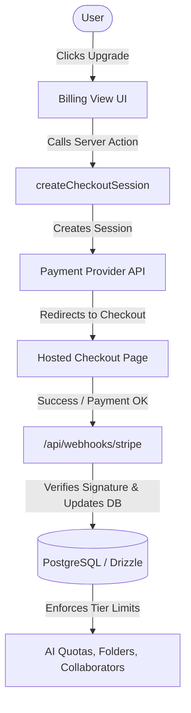

# Complete Step-by-Step Guide: Implementing Billing & Subscriptions in Docify

This guide walks you through integrating a production-ready subscription billing system (using **Stripe** or **Lemon Squeezy**) into Docify with **Next.js 15 (App Router)**, **Better-Auth**, and **Drizzle ORM (PostgreSQL)**.

---

## 🏗️ Architecture Overview



---

## 📋 Step 1: Database Schema Migration

Add a `subscription` table (or subscription columns to the `user` table) in [`src/db/schema.ts`](file:///home/myb/Dev/docify/src/db/schema.ts) to track plan status, customer IDs, and billing period ends.

```typescript
// src/db/schema.ts
import { pgTable, text, timestamp, boolean } from "drizzle-orm/pg-core";

export const subscription = pgTable("subscription", {
  id: text("id").primaryKey(), // Internal ID or Sub ID
  userId: text("user_id")
    .notNull()
    .unique()
    .references(() => user.id, { onDelete: "cascade" }),
  stripeCustomerId: text("stripe_customer_id").unique(),
  stripeSubscriptionId: text("stripe_subscription_id").unique(),
  stripePriceId: text("stripe_price_id"),
  plan: text("plan").default("free").notNull(), // 'free' | 'plus' | 'pro'
  status: text("status").default("active").notNull(), // 'active' | 'canceled' | 'past_due' | 'trialing'
  currentPeriodStart: timestamp("current_period_start"),
  currentPeriodEnd: timestamp("current_period_end"),
  cancelAtPeriodEnd: boolean("cancel_at_period_end").default(false),
  createdAt: timestamp("created_at").defaultNow().notNull(),
  updatedAt: timestamp("updated_at")
    .defaultNow()
    .$onUpdate(() => new Date())
    .notNull(),
});
```

Run migration:
```bash
bun drizzle-kit push
```

---

## 📦 Step 2: Install SDK & Configure Environment Variables

### 1. Install Stripe SDK
```bash
bun add stripe @stripe/stripe-js
```

### 2. Configure Environment Variables (`.env`)
```env
# Stripe API Keys
STRIPE_SECRET_KEY=sk_test_...
STRIPE_WEBHOOK_SECRET=whsec_...
NEXT_PUBLIC_STRIPE_PUBLISHABLE_KEY=pk_test_...

# Stripe Price IDs (from Stripe Dashboard -> Products)
NEXT_PUBLIC_STRIPE_PLUS_MONTHLY_PRICE_ID=price_...
NEXT_PUBLIC_STRIPE_PLUS_ANNUAL_PRICE_ID=price_...
NEXT_PUBLIC_STRIPE_PRO_MONTHLY_PRICE_ID=price_...
NEXT_PUBLIC_STRIPE_PRO_ANNUAL_PRICE_ID=price_...

# App URL
NEXT_PUBLIC_APP_URL=http://localhost:3000
```

### 3. Initialize Stripe Client
Create [`src/lib/stripe.ts`](file:///home/myb/Dev/docify/src/lib/stripe.ts):
```typescript
// src/lib/stripe.ts
import Stripe from "stripe";

export const stripe = new Stripe(process.env.STRIPE_SECRET_KEY!, {
  apiVersion: "2025-02-24.acacia" as any,
  typescript: true,
});
```

---

## 💳 Step 3: Create Checkout Session & Customer Portal

Create [`src/server/billing.ts`](file:///home/myb/Dev/docify/src/server/billing.ts):

```typescript
// src/server/billing.ts
"use server";

import { stripe } from "@/lib/stripe";
import { db } from "@/db/drizzle";
import { subscription, user } from "@/db/schema";
import { auth } from "@/lib/auth";
import { headers } from "next/headers";
import { eq } from "drizzle-orm";

const APP_URL = process.env.NEXT_PUBLIC_APP_URL || "http://localhost:3000";

export async function createCheckoutSession(priceId: string) {
  const session = await auth.api.getSession({ headers: await headers() });
  if (!session?.user?.id) {
    throw new Error("Unauthorized. Please log in.");
  }

  // 1. Check existing customer or subscription
  const [existingSub] = await db
    .select()
    .from(subscription)
    .where(eq(subscription.userId, session.user.id));

  let customerId = existingSub?.stripeCustomerId;

  // 2. Create customer in Stripe if not exists
  if (!customerId) {
    const customer = await stripe.customers.create({
      email: session.user.email,
      name: session.user.name,
      metadata: {
        userId: session.user.id,
      },
    });
    customerId = customer.id;
  }

  // 3. Create Stripe Checkout Session
  const checkoutSession = await stripe.checkout.sessions.create({
    customer: customerId,
    mode: "subscription",
    payment_method_types: ["card"],
    line_items: [
      {
        price: priceId,
        quantity: 1,
      },
    ],
    metadata: {
      userId: session.user.id,
    },
    success_url: `${APP_URL}/billing?success=true`,
    cancel_url: `${APP_URL}/billing?canceled=true`,
    subscription_data: {
      metadata: {
        userId: session.user.id,
      },
    },
  });

  return { url: checkoutSession.url };
}

export async function createCustomerPortalSession() {
  const session = await auth.api.getSession({ headers: await headers() });
  if (!session?.user?.id) {
    throw new Error("Unauthorized.");
  }

  const [sub] = await db
    .select()
    .from(subscription)
    .where(eq(subscription.userId, session.user.id));

  if (!sub?.stripeCustomerId) {
    throw new Error("No active billing account found.");
  }

  const portalSession = await stripe.billingPortal.sessions.create({
    customer: sub.stripeCustomerId,
    return_url: `${APP_URL}/billing`,
  });

  return { url: portalSession.url };
}
```

---

## ⚡ Step 4: Webhook Handler for Automatic Plan Updates

Create a route handler in [`src/app/api/webhooks/stripe/route.ts`](file:///home/myb/Dev/docify/src/app/api/webhooks/stripe/route.ts) to handle subscription lifecycle events:

```typescript
// src/app/api/webhooks/stripe/route.ts
import { headers } from "next/headers";
import { NextResponse } from "next/server";
import { stripe } from "@/lib/stripe";
import { db } from "@/db/drizzle";
import { subscription } from "@/db/schema";
import { eq } from "drizzle-orm";
import { nanoid } from "nanoid";
import Stripe from "stripe";

export async function POST(req: Request) {
  const body = await req.text();
  const signature = (await headers()).get("Stripe-Signature");

  if (!signature) {
    return new NextResponse("Missing Stripe-Signature header", { status: 400 });
  }

  let event: Stripe.Event;

  try {
    event = stripe.webhooks.constructEvent(
      body,
      signature,
      process.env.STRIPE_WEBHOOK_SECRET!
    );
  } catch (err: any) {
    return new NextResponse(`Webhook Error: ${err.message}`, { status: 400 });
  }

  const session = event.data.object as any;

  switch (event.type) {
    // 1. Checkout completed -> Assign plan
    case "checkout.session.completed": {
      const stripeSub = await stripe.subscriptions.retrieve(
        session.subscription as string
      );
      const userId = session.metadata?.userId || stripeSub.metadata?.userId;
      if (!userId) break;

      const priceId = stripeSub.items.data[0].price.id;
      const plan = resolvePlanFromPriceId(priceId);

      const [existing] = await db
        .select()
        .from(subscription)
        .where(eq(subscription.userId, userId));

      if (existing) {
        await db
          .update(subscription)
          .set({
            stripeSubscriptionId: stripeSub.id,
            stripeCustomerId: stripeSub.customer as string,
            stripePriceId: priceId,
            plan,
            status: stripeSub.status,
            currentPeriodStart: new Date(stripeSub.current_period_start * 1000),
            currentPeriodEnd: new Date(stripeSub.current_period_end * 1000),
          })
          .where(eq(subscription.userId, userId));
      } else {
        await db.insert(subscription).values({
          id: nanoid(),
          userId,
          stripeSubscriptionId: stripeSub.id,
          stripeCustomerId: stripeSub.customer as string,
          stripePriceId: priceId,
          plan,
          status: stripeSub.status,
          currentPeriodStart: new Date(stripeSub.current_period_start * 1000),
          currentPeriodEnd: new Date(stripeSub.current_period_end * 1000),
        });
      }
      break;
    }

    // 2. Subscription updated (renewal, plan upgrade/downgrade)
    case "customer.subscription.updated": {
      const stripeSub = event.data.object as Stripe.Subscription;
      const priceId = stripeSub.items.data[0].price.id;
      const plan = resolvePlanFromPriceId(priceId);

      await db
        .update(subscription)
        .set({
          plan,
          status: stripeSub.status,
          stripePriceId: priceId,
          cancelAtPeriodEnd: stripeSub.cancel_at_period_end,
          currentPeriodStart: new Date(stripeSub.current_period_start * 1000),
          currentPeriodEnd: new Date(stripeSub.current_period_end * 1000),
        })
        .where(eq(subscription.stripeSubscriptionId, stripeSub.id));
      break;
    }

    // 3. Subscription deleted / canceled
    case "customer.subscription.deleted": {
      const stripeSub = event.data.object as Stripe.Subscription;
      await db
        .update(subscription)
        .set({
          plan: "free",
          status: "canceled",
          cancelAtPeriodEnd: false,
        })
        .where(eq(subscription.stripeSubscriptionId, stripeSub.id));
      break;
    }
  }

  return NextResponse.json({ received: true });
}

function resolvePlanFromPriceId(priceId: string): "free" | "plus" | "pro" {
  if (
    priceId === process.env.NEXT_PUBLIC_STRIPE_PRO_MONTHLY_PRICE_ID ||
    priceId === process.env.NEXT_PUBLIC_STRIPE_PRO_ANNUAL_PRICE_ID
  ) {
    return "pro";
  }
  if (
    priceId === process.env.NEXT_PUBLIC_STRIPE_PLUS_MONTHLY_PRICE_ID ||
    priceId === process.env.NEXT_PUBLIC_STRIPE_PLUS_ANNUAL_PRICE_ID
  ) {
    return "plus";
  }
  return "free";
}
```

---

## 🛡️ Step 5: Feature Gating & Quotas Enforcement

Create [`src/lib/permissions.ts`](file:///home/myb/Dev/docify/src/lib/permissions.ts) to enforce plan quotas across your app:

```typescript
// src/lib/permissions.ts
export const PLAN_LIMITS = {
  free: {
    maxAiQueriesPerDay: 10,
    maxFolders: 5,
    maxCollaboratorsPerDoc: 3,
    hasMarkdownExport: false,
    hasVersionHistory: false,
  },
  plus: {
    maxAiQueriesPerDay: 100,
    maxFolders: Infinity,
    maxCollaboratorsPerDoc: Infinity,
    hasMarkdownExport: true,
    hasVersionHistory: true,
  },
  pro: {
    maxAiQueriesPerDay: Infinity,
    maxFolders: Infinity,
    maxCollaboratorsPerDoc: Infinity,
    hasMarkdownExport: true,
    hasVersionHistory: true,
  },
} as const;

export type PlanName = keyof typeof PLAN_LIMITS;
```

### Example Quota Enforcement in AI Assistant (`src/server/ai.ts`):
```typescript
const plan = userSubscription?.plan || "free";
const dailyLimit = PLAN_LIMITS[plan].maxAiQueriesPerDay;

if (userDailyUsage >= dailyLimit) {
  return {
    error: {
      message: `Daily AI limit reached (${dailyLimit} queries). Please upgrade to Plus or Pro.`,
    },
  };
}
```

---

## 🎨 Step 6: Connect to Frontend UI

In [`src/components/billing-view.tsx`](file:///home/myb/Dev/docify/src/components/billing-view.tsx), replace the mock upgrade with `createCheckoutSession`:

```typescript
// Example frontend handler:
const handleRealUpgrade = async (priceId: string) => {
  try {
    const res = await createCheckoutSession(priceId);
    if (res.url) {
      window.location.href = res.url; // Redirect to Stripe checkout
    }
  } catch (error: any) {
    toast.error(error.message);
  }
};
```

---

## 🧪 Step 7: Local Testing with Stripe CLI

1. **Install Stripe CLI**:
   ```bash
   curl -s https://packages.stripe.dev/api/security/keypair/stripe-cli/gpg | gpg --dearmor | sudo tee /usr/share/keyrings/stripe.gpg
   echo "deb [signed-by=/usr/share/keyrings/stripe.gpg] https://packages.stripe.dev/stripe-cli-debian-local stable main" | sudo tee /etc/apt/sources.list.d/stripe.list
   sudo apt update && sudo apt install stripe
   ```

2. **Login & Forward Webhooks**:
   ```bash
   stripe login
   stripe listen --forward-to localhost:3000/api/webhooks/stripe
   ```

3. **Copy the printed webhook secret** (e.g. `whsec_...`) into your `.env` file as `STRIPE_WEBHOOK_SECRET`.

---

## ✅ Production Launch Checklist

- [ ] Create Live Products & Pricing in Stripe Dashboard (Free, Plus, Pro).
- [ ] Set live environment variables (`STRIPE_SECRET_KEY`, `STRIPE_WEBHOOK_SECRET`).
- [ ] Enable Customer Portal in Stripe Dashboard Settings (*Settings -> Customer Portal*).
- [ ] Set up production Webhook endpoint in Stripe Dashboard pointing to `https://yourdomain.com/api/webhooks/stripe`.
- [ ] Test upgrade, downgrade, canceled subscriptions, and invoice receipt downloads.
